# Cuna UNSA

> Proyecto web desarrollado como parte del curso [Programacion Web]  
> 🏫 Universidad Nacional de San Agustín  
> 👩‍💻 Integrantes: Camila Alarico, Laura Vilca, Elkin Ramos, Cristhian Bravo  
> 👨‍🏫 Docente: Carlo Corrales Delgado

## Descripción General
Este proyecto consiste en el desarrollo de una aplicación web para optimizar el proceso de admisión del Cuna-Jardín de la Universidad Nacional de San Agustín (UNSA). La plataforma permite registrar y gestionar postulantes, padres de familia, etapas del proceso y pagos, todo desde un panel administrativo seguro y fácil de usar.

El sistema se compone de:
- Un Backend en Django, encargado de la lógica del sistema y la gestión de datos.
- Un Frontend en Angular, que presenta información institucional de forma dinámica y atractiva para los usuarios.

Entre las principales funcionalidades se incluyen:
- Vistas como crear, listar, actualizar y eliminar.
- Inicio de sesión seguro para administradores.
- Generación de informes en PDF.
- Diseño adaptable con Angular y uso de plantillas para una experiencia de usuario moderna.

## Tabla de Contenidos
- [Descripción General](#descripción-general)
- [URLs](#urls)
- [Tecnologias Usadas](#tecnologias_usadas)
- [Modelo de Datos](#modelo-de-datos)
- [Instrucciones de instalación local](#instrucciones)
- [Backend](#backend)
- [FrontEnd](#frontend)
- [Recomendaciones](#recomendaciones)
- [Conclusiones](#conclusiones)

---

## URLs

- 🔗 Repositorio: [GitHub Backend]([https://github.com/usuario/proyecto-backend](https://github.com/Camila-Alarico/PW2---Trabajo-Final.git))
- 🌐 URL del sitio desplegado con dominio HTTPS: [https://www.miappweb.com](https://www.miappweb.com)
  - **Usuario para probar**: `admin`  
  - **Contraseña**: `admin123`

---

## Tecnologias Usadas
- **Frontend:** Angular, CSS, HTML5
- **Backend:** Django
- **AJAX:** JavaScript, Fetch API
- **Base de Datos:** SQLite
- **PDFs:** html2pdf.js

---

## Modelo de Datos

modelo entidad-relación del sistema:

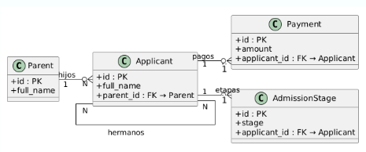
> Diagrama creado con [dbdiagram.io](https://dbdiagram.io)

Usamos varios modelos relacionados:

- `Postulante`
- `Padre`
- `Etapa`
- `Pago`

Relaciones:
- Un `Padre` puede tener varios `Postulantes` (ForeignKey)
- Un `Postulante` pertenece a una `Etapa`

---
    
## Instrucciones de instalación local

### Para Django:
*Requisitos:*
Python 3.12+, PostgreSQL o SQLite
pipenv o venv para entorno virtual

*Instalación y entorno*
cd /ruta/del/proyecto
python -m venv env
source env/bin/activate
pip install -r requirements.txt

python manage.py migrate
python manage.py createsuperuser
python manage.py runserver 8001

http://127.0.0.1:8001/

### Para Angular:
*Requisitos:*
Node.js, npm
Angular CLI (npm install -g @angular/cli)

*Instalación:*
cd frontend/colegio-inicial
npm install
ng serve
http://localhost:4200/


---

## Backend

### Django
Django es un framework web de código abierto escrito en Python que facilita el desarrollo rápido y limpio de aplicaciones web complejas. Se enfoca en la reutilización de código y en la seguridad, permitiendo a los desarrolladores construir aplicaciones robustas y escalables de manera eficiente.

Se hicieron modelos de:
```python
class Parent(models.Model):
    full_name = models.CharField(max_length=100)
    dni = models.CharField(max_length=10, unique=True)
    email = models.EmailField()
    phone = models.CharField(max_length=15)
    # Otros campos omitidos por brevedad

class Applicant(models.Model):
    full_name = models.CharField(max_length=100)
    birth_date = models.DateField()
    grade_applied = models.CharField(max_length=10, choices=[...])
    parent = models.ForeignKey(Parent, on_delete=models.CASCADE)
    # Relaciones con hermanos y campos adicionales

class Payment(models.Model):
    applicant = models.ForeignKey(Applicant, on_delete=models.CASCADE)
    amount = models.DecimalField(max_digits=6, decimal_places=2)
    bank = models.CharField(max_length=30, choices=[...])

class AdmissionStage(models.Model):
    applicant = models.ForeignKey(Applicant, on_delete=models.CASCADE)
    stage = models.CharField(max_length=20, choices=[...])
    date = models.DateField()
    completed = models.BooleanField(default=False)
```

Se implementaron vistas de:
- Listado
  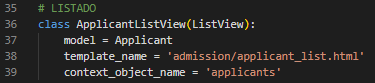
- Detalle
  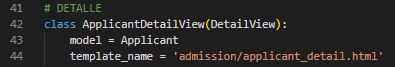
- Crear
  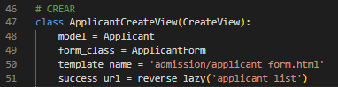
- Actualizar
  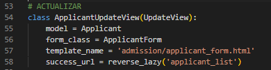
- Eliminar 
  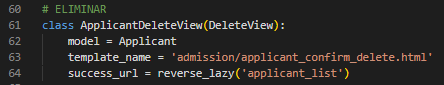

---

## FrontEnd

### Angular:
**Angular** es un framework de JavaScript mantenido por Google, que permite construir interfaces web de una sola página (**SPA - Single Page Application**) usando componentes reutilizables, rutas, formularios y servicios para conectarse con APIs.

### ¿Cómo se usó en el proyecto?
- Se creó una interfaz con diseño responsive usando Angular + CSS.
- Se definieron **rutas** para navegar entre las páginas principales.
- Se utilizaron **componentes** para dividir la lógica en partes reutilizables (ej: `home`, `información`, `admisión`, etc.).

- Página de inicio:  
  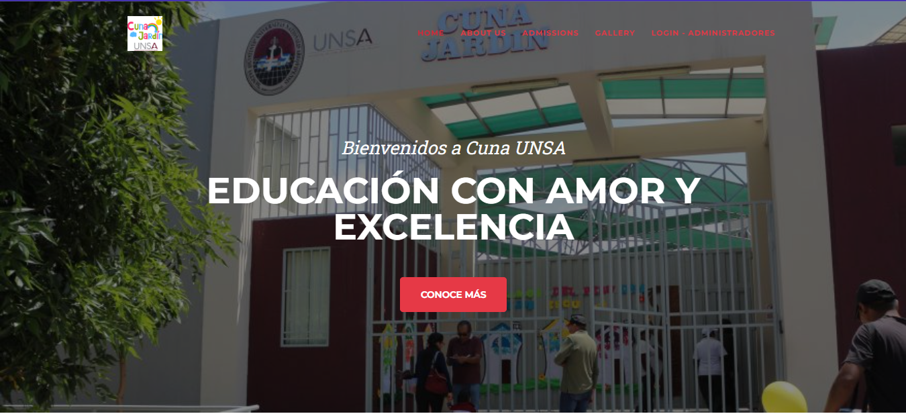

- Página informativa de la Cuna UNSA:  
  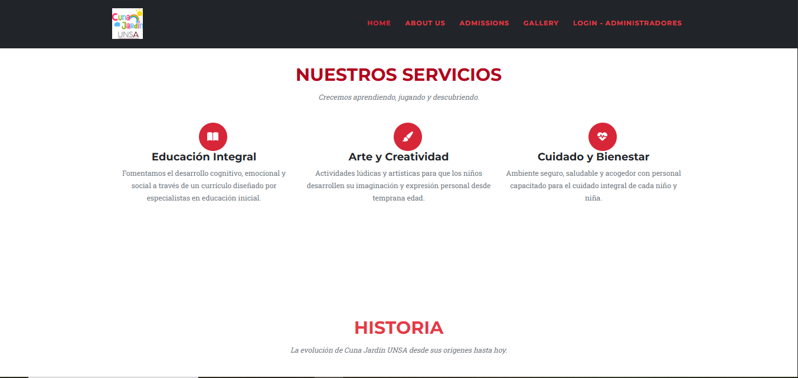

- Pagina "About Us":
  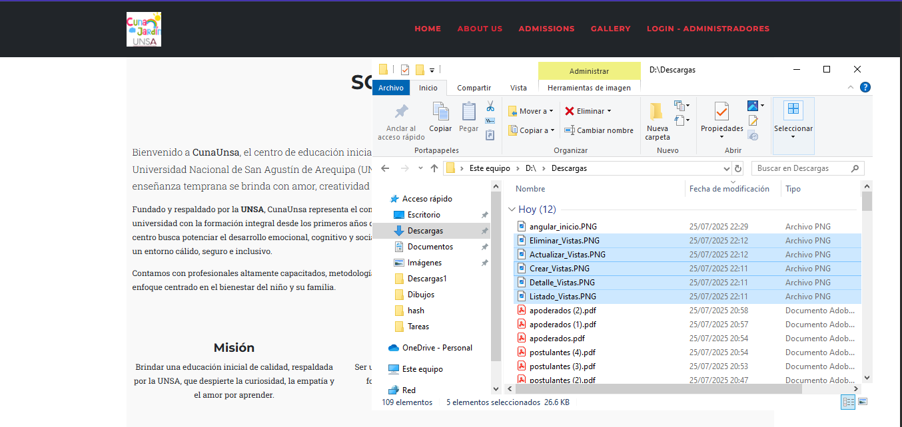
  
- Pagina del listado de admisiones:
  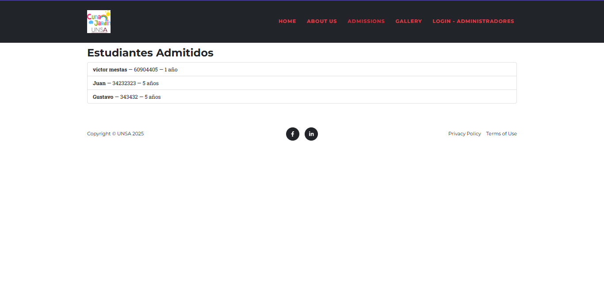
  
- Galeria de Fotos:
  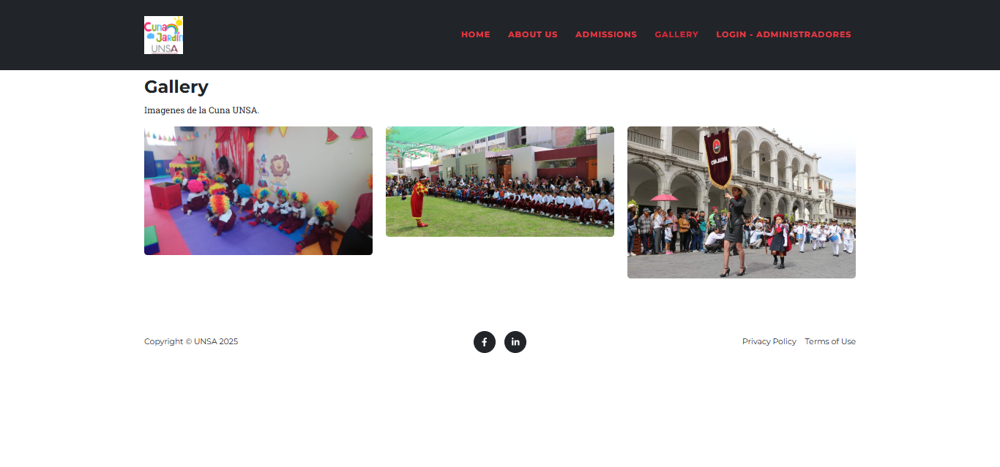
  
- Pagina para el login de los administradores:
  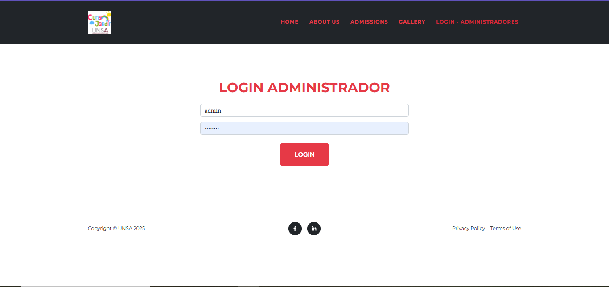
  

---

## Recomendaciones
- Optimizar el rendimiento del sistema utilizando una base de datos y configuraciones avanzadas.
- Dividir el frontend Angular en módulos para poder ver todas las paginas (postulantes, padres, pagos) para facilitar el mantenimiento y escalabilidad del código.
- Implementar control de acceso basado en roles para separar permisos entre administradores y personal de apoyo.
- Realizar mejoras en la experiencia de usuario y accesibilidad para facilitar su uso por parte del personal educativo.
- Mejorar la interfaz del proyecto para mas comodidad visual.

---

## Conclusiones
- El desarrollo de Cuna UNSA permitió implementar una aplicación web funcional y automatizada para el proceso de admisión del Cuna-Jardín UNSA, facilitando la gestión de postulantes, padres, etapas y pagos.
- Se logró integrar correctamente el backend desarrollado en Django con el frontend en Angular, implementando un sistema modular y escalable.
- La creación de vistas CRUD, formularios con validaciones, y el uso de AJAX fueron usados para desarrollar este proyecto.
- El proyecto permitió afianzar conocimientos técnicos en Django y Angular.
- El sistema queda listo para futuras ampliaciones.


" https://www.unsa.edu.pe/proceso-de-admision-cuna-jardin-unsa-2024/

Proceso de admision cuna-jardin unsa 
Estimados padres de familia, nuestra institución agradece su interés por formar parte de nuestra comunidad, les
informamos que desarrollaremos el proceso de admisión para las aulas 1 año, 2 años, 4 años y 5 años 2024 en forma presencial.
VACANTES A OFERTAR
 Aula de 1 año : 15 vacantes  Aula de 2 años: 20vacantes  Aula de 4 años: 5 vacantes   Aula de 5 años: 5 vacantes
HORARIO: Lunes a viernes de 8:45 a 13:30 horas
REQUISITOS
Los postulantes deben de cumplir la edad a la que postulan hasta el 31 de marzo ejemplo (si mi niño postula al aula de 2 años deberá de cumplir máximo los 2 años hasta el 31 de marzo 2024)
Derecho de admisión por el monto de s/. 100.00 en las cuentas que se brindará (Banco de la Nación Cuenta Corriente Nro.00-101-202-992.
Solicitante: Nombre o DNI del niño (a) o Padre
BCP Cta. a Abonar: 215-1588792-0-19
Cód. ID Usuario: Nombre o DNI del niño (a) o PadreDescripción: pagos varios).
DNI del postulante original y una copia
Formato de inscripción que se llenará en la institución.
Traer el voucher de admisión original y, copia DNI en un file, en la portada del mismo deberá ir los nombres y aula
que su menor niño o niña postula
INSCRIPCIONES PROCESO ADMISIÓN
 02 al 9 de enero 2024
ENTREVISTAS A LOS PADRES DE FAMILIA
 10 al 15 de enero 2024 de acuerdo al cronograma
CONVIVENCIA
 16 al 19 de enero 2024 de acuerdo al cronograma
RESULTADOS DE LOS INGRESANTES
 23 de enero 2024
MATRICULAS SOLO PARA INGRESANTES
 25 al 31 de enero 2024


cumplir lo siguiente:

○	Una app independiente
■	URLs propios, usando reverse (2 puntos)
■	Plantillas propias de la aplicación (1 puntos)
■	Que usen widgets de manera elegante (1 puntos)
○	Vistas de Listado, Detalle, Crear, Actualizar y Borrar (4 puntos)
■	Formulario con restricciones de seguridad adicionales (2 puntos)
○	Vista de consultas que devuelva Json (3 puntos)
■	Programa cliente para hacer y consumir las consultas
■	Con Ajax (2 puntos)
■	Con Framework de JavaScript (3 puntos)
○	Al menos dos modelos (2 puntos)
■	Modelo con clave externa: foreign key (+2 puntos, opcional)
○	CSS o Bootstrap (2 puntos)
○	Publicó su aplicación en el web (+3 puntos, opcional)
○	Descargar un informe como archivos pdf (+2 puntos, opcional)
○	Enviar correo (+2 puntos, opcional)

" 


